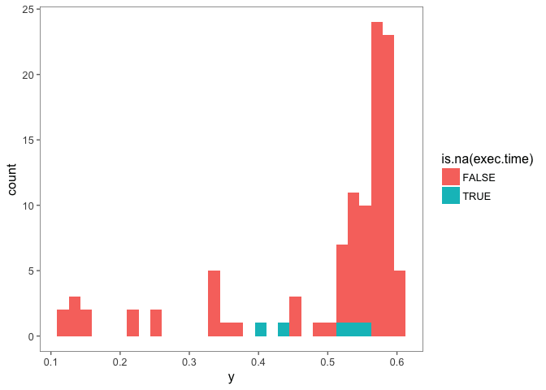
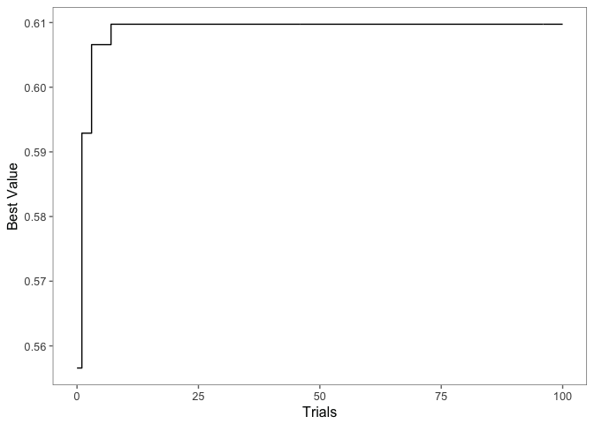
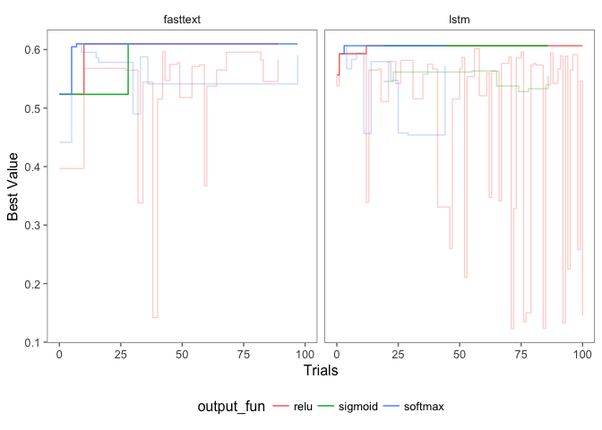
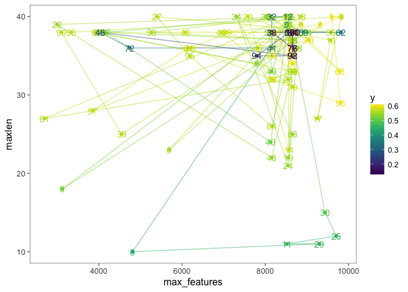

tidy.mbo vignette
================
Simon
14 4 2018

Packages
--------

``` r
#devtools::install_github("systats/tidy.mbo")
pacman::p_load(tidyverse, dplyr, purrr, rsample, data.table, magrittr, tidyTX, keras, mlrMBO, tidy.mbo, ggthemes, Smisc)
```

    ## Warning: package 'tidy.mbo' is not available (for R version 3.4.2)

    ## Bioconductor version 3.6 (BiocInstaller 1.28.0), ?biocLite for help

    ## Warning in p_install(package, character.only = TRUE, ...):

    ## Warning in library(package, lib.loc = lib.loc, character.only = TRUE,
    ## logical.return = TRUE, : there is no package called 'tidy.mbo'

    ## Warning in pacman::p_load(tidyverse, dplyr, purrr, rsample, data.table, : Failed to install/load:
    ## tidy.mbo

``` r
#keras::install_keras()
set.seed(2018)
ggplot2::theme_set(ggthemes::theme_few())
```

Data
----

``` r
split_data <- function(data, p){

  train_id  <- caret::createDataPartition(y = data$index, p = p, list = F)
  train <- data[train_id,]
  test  <- data[-train_id,]

  return(list(train = train, test = test))
}

dt <- get(load("df_clean.Rdata")) %>% 
  mutate(index = 1:n()) %>%
  split_data(p = .7)
```

``` r
listLearners("regr", properties = c("factors", "se"))
```

    ## Warning in listLearners.character("regr", properties = c("factors", "se")): The following learners could not be constructed, probably because their packages are not installed:
    ## classif.ada,classif.adaboostm1,classif.bartMachine,classif.blackboost,classif.boosting,classif.bst,classif.C50,classif.cforest,classif.clusterSVM,classif.ctree,classif.dbnDNN,classif.dcSVM,classif.evtree,classif.extraTrees,classif.fdausc.glm,classif.fdausc.kernel,classif.fdausc.knn,classif.fdausc.np,classif.gamboost,classif.gaterSVM,classif.gbm,classif.geoDA,classif.glmboost,classif.IBk,classif.J48,classif.JRip,classif.kknn,classif.LiblineaRL1L2SVC,classif.LiblineaRL1LogReg,classif.LiblineaRL2L1SVC,classif.LiblineaRL2LogReg,classif.LiblineaRL2SVC,classif.LiblineaRMultiClassSVC,classif.linDA,classif.lqa,classif.mda,classif.mlp,classif.neuralnet,classif.nnTrain,classif.nodeHarvest,classif.OneR,classif.pamr,classif.PART,classif.penalized,classif.plr,classif.plsdaCaret,classif.quaDA,classif.randomForestSRC,classif.ranger,classif.rda,classif.rFerns,classif.rknn,classif.rotationForest,classif.RRF,classif.rrlda,classif.saeDNN,classif.sda,classif.sparseLDA,cluster.cmeans,cluster.Cobweb,cluster.EM,cluster.FarthestFirst,cluster.kmeans,cluster.SimpleKMeans,cluster.XMeans,multilabel.cforest,multilabel.randomForestSRC,multilabel.rFerns,regr.bartMachine,regr.bcart,regr.bgp,regr.bgpllm,regr.blackboost,regr.blm,regr.brnn,regr.bst,regr.btgp,regr.btgpllm,regr.btlm,regr.cforest,regr.crs,regr.ctree,regr.cubist,regr.elmNN,regr.evtree,regr.extraTrees,regr.FDboost,regr.frbs,regr.gamboost,regr.gbm,regr.glmboost,regr.IBk,regr.kknn,regr.laGP,regr.LiblineaRL2L1SVR,regr.LiblineaRL2L2SVR,regr.mars,regr.mob,regr.nodeHarvest,regr.pcr,regr.penalized,regr.plsr,regr.randomForestSRC,regr.ranger,regr.rknn,regr.RRF,regr.rsm,regr.slim,surv.cforest,surv.CoxBoost,surv.cv.CoxBoost,surv.gamboost,surv.gbm,surv.glmboost,surv.randomForestSRC,surv.ranger
    ## Check ?learners to see which packages you need or install mlr with all suggestions.

    ##          class
    ## 1   regr.bcart
    ## 2    regr.btgp
    ## 3 regr.btgpllm
    ## 4    regr.btlm
    ## 5     regr.crs
    ## 6 regr.gausspr
    ##                                                                      name
    ## 1                                                           Bayesian CART
    ## 2                                         Bayesian Treed Gaussian Process
    ## 3 Bayesian Treed Gaussian Process with jumps to the Limiting Linear Model
    ## 4                                             Bayesian Treed Linear Model
    ## 5                                                      Regression Splines
    ## 6                                                      Gaussian Processes
    ##   short.name package type installed numerics factors ordered missings
    ## 1      bcart     tgp regr     FALSE     TRUE    TRUE   FALSE    FALSE
    ## 2       btgp     tgp regr     FALSE     TRUE    TRUE   FALSE    FALSE
    ## 3    btgpllm     tgp regr     FALSE     TRUE    TRUE   FALSE    FALSE
    ## 4       btlm     tgp regr     FALSE     TRUE    TRUE   FALSE    FALSE
    ## 5        crs     crs regr     FALSE     TRUE    TRUE   FALSE    FALSE
    ## 6    gausspr kernlab regr      TRUE     TRUE    TRUE   FALSE    FALSE
    ##   weights  prob oneclass twoclass multiclass class.weights featimp
    ## 1   FALSE FALSE    FALSE    FALSE      FALSE         FALSE   FALSE
    ## 2   FALSE FALSE    FALSE    FALSE      FALSE         FALSE   FALSE
    ## 3   FALSE FALSE    FALSE    FALSE      FALSE         FALSE   FALSE
    ## 4   FALSE FALSE    FALSE    FALSE      FALSE         FALSE   FALSE
    ## 5    TRUE FALSE    FALSE    FALSE      FALSE         FALSE   FALSE
    ## 6   FALSE FALSE    FALSE    FALSE      FALSE         FALSE   FALSE
    ##   oobpreds functionals single.functional   se lcens rcens icens
    ## 1    FALSE       FALSE             FALSE TRUE FALSE FALSE FALSE
    ## 2    FALSE       FALSE             FALSE TRUE FALSE FALSE FALSE
    ## 3    FALSE       FALSE             FALSE TRUE FALSE FALSE FALSE
    ## 4    FALSE       FALSE             FALSE TRUE FALSE FALSE FALSE
    ## 5    FALSE       FALSE             FALSE TRUE FALSE FALSE FALSE
    ## 6    FALSE       FALSE             FALSE TRUE FALSE FALSE FALSE
    ## ... (#rows: 10, #cols: 24)

``` r
listLearnerProperties("regr")
```

    ##  [1] "numerics"          "factors"           "ordered"          
    ##  [4] "missings"          "weights"           "se"               
    ##  [7] "featimp"           "oobpreds"          "functionals"      
    ## [10] "single.functional"

Hyper Params
------------

``` r
params <- makeParamSet(
    makeIntegerParam("max_features", lower = 2000, upper = 10000),
    makeIntegerParam("maxlen", lower = 10, upper = 40),
    makeIntegerParam("batch_size", lower = 10, upper = 30),
    makeIntegerParam("output_dim", lower = 60, upper = 200),
    makeDiscreteParam("output_fun", values = c("softmax", "relu", "sigmoid")),
    makeDiscreteParam("arch", values = c("fasttext", "lstm"))
  )
```

Run Main
--------

<table style="width:93%;">
<colgroup>
<col width="6%" />
<col width="34%" />
<col width="6%" />
<col width="44%" />
</colgroup>
<thead>
<tr class="header">
<th>Metric Type</th>
<th>Metric Name</th>
<th>Function Name</th>
<th>Formula</th>
</tr>
</thead>
<tbody>
<tr class="odd">
<td>classification</td>
<td>Classification Error</td>
<td>ce</td>
<td><span class="math inline">$\frac{1}{n} \sum_{i=1}^n I(x_i \neq y_i)$</span></td>
</tr>
<tr class="even">
<td>classification</td>
<td>Accuracy</td>
<td>accuracy</td>
<td><span class="math inline">$\frac{1}{n} \sum_{i=1}^n I(x_i = y_i)$</span></td>
</tr>
<tr class="odd">
<td>classification</td>
<td>F1 Score</td>
<td>f1</td>
<td><span class="math inline">$\frac{2 * \text{precision} * \text{recall}}{\text{precision} + \text{recall}}$</span></td>
</tr>
<tr class="even">
<td>binary classification</td>
<td>Area Under ROC Curve</td>
<td>auc</td>
<td><span class="math inline">∫<sub>0</sub><sup>1</sup>[1 − <em>G</em><sub>1</sub>(<em>G</em><sub>0</sub><sup>−1</sup>(1 − <em>v</em>))]<em>d</em><em>v</em></span>. <code>help(auc)</code> for details.</td>
</tr>
<tr class="odd">
<td>binary classification</td>
<td>Log Loss</td>
<td>ll</td>
<td><span class="math inline"><em>x</em><sub><em>i</em></sub> * ln(<em>y</em><sub><em>i</em></sub>)+(1 − <em>x</em><sub><em>i</em></sub>)*ln(1 − <em>y</em><sub><em>i</em></sub>)</span></td>
</tr>
<tr class="even">
<td>binary classification</td>
<td>Mean Log Loss</td>
<td>logloss</td>
<td><span class="math inline">$\frac{1}{n} \sum_{i=1}^n x_i * \ln(y_i) + (1 - x_i) * \ln(1 - y_i)$</span></td>
</tr>
</tbody>
</table>

``` r
#install.packages("Metrics")
results <- params %>% 
  tidy.mbo::run_mbo(
    data = dt,
    target = "party_id", 
    text = "text_lemma",
    name = "glove_model1", 
    n_init = 5, 
    n_main = 100
  )
```

``` r
library(dplyr)
perform <- results$opt.path$env$path %>% 
  cbind(
    .,
    exec.time = results$opt.path$env$exec.time,
    step = results$opt.path$env$dob
  ) %>% 
  arrange(desc(y)) %>% 
  as.tibble()

#error <- results$opt.path$env$extra
#exec.time <- results$opt.path$env$
perform
```

    ## # A tibble: 105 x 9
    ##    max_features maxlen batch_size output_dim output_fun arch         y
    ##           <int>  <int>      <int>      <int> <chr>      <chr>    <dbl>
    ##  1         8600     37         12        197 softmax    fasttext 0.610
    ##  2         9812     40         13        188 softmax    lstm     0.607
    ##  3         9599     40         14        145 softmax    fasttext 0.605
    ##  4         9808     29         24        197 relu       lstm     0.601
    ##  5         8159     32         21        191 relu       fasttext 0.596
    ##  6         8705     33         27        199 relu       lstm     0.596
    ##  7         8156     35         22        200 relu       fasttext 0.596
    ##  8         8483     40         19        197 softmax    fasttext 0.595
    ##  9         9796     33         24        197 relu       fasttext 0.595
    ## 10         8530     39         20        149 softmax    lstm     0.594
    ## # ... with 95 more rows, and 2 more variables: exec.time <dbl>, step <int>

Distribution of accuracy history

``` r
perform %>%
  ggplot(aes(y, fill = is.na(exec.time))) + 
  geom_histogram()
```

    ## `stat_bin()` using `bins = 30`. Pick better value with `binwidth`.



Distribution of accuracy history

``` r
#devtools::install_github("tidyverse/ggplot2")
perform %>%
  ggplot(aes(max_features, maxlen, colour = y, size = y)) + 
  geom_point(alpha = .5) +
  scale_size_continuous(range(1, 10)) +
  viridis::scale_colour_viridis()

perform %>%
  ggplot(aes(max_features, maxlen, colour = y)) + 
  geom_point() +
  geom_density_2d()

perform %>%
  ggplot(aes(max_features, maxlen)) + 
    stat_density_2d(geom = "polygon", aes(fill = ..level.., alpha=..level..)) +
    viridis::scale_fill_viridis()

perform %>%
  ggplot(aes(max_features, maxlen)) + 
  stat_density_2d(geom = "raster", aes(fill = ..density..), contour = F) +
    viridis::scale_fill_viridis()
  
perform %>%
  ggplot(aes(max_features, maxlen)) + 
  stat_density_2d(geom = "raster", aes(fill = ..density.., alpha=..density..), contour = F) +
    viridis::scale_fill_viridis()

perform %>%
  ggplot(aes(max_features, maxlen)) + 
  stat_density_2d(geom = "point", aes(size = ..density..), n = 20, contour = F, alpha = .7)
  #geom_point() +
  # stat_density_2d(
  #   data = bar,
  #   mapping = aes( x = x, y = y, fill = ..level.. ),
  #   geom = "polygon" )
```

``` r
perform %>%
  dplyr::select(
    max_features, maxlen, 
    batch_size,output_dim, 
    output_fun, y
  ) %>%
  tidyr::gather("param", "value", -y, -output_fun) %>%
  ggplot(aes(value, y, colour = y)) + 
  #geom_tile() +
  #geom_raster() + 
  geom_density_2d(alpha = .8, color = "grey")+
  geom_point() +
  viridis::scale_colour_viridis("Accuracy") +
  facet_grid(output_fun~param, scales = "free") +
  theme(legend.position = "bottom")
```


``` r
perform %>%
  dplyr::select(max_features:output_fun) %>%
  dplyr::select_if(is.numeric) %>%
  mutate(id = 1:n()) %>%
  gather("var", "value", -id) %>%
  ggplot(aes(value)) +
  geom_histogram() +
  ggplot2::facet_wrap(. ~ var)
```

Experiment Improvement

``` r
perform %>%
  arrange(step) %>%
  mutate(best = Smisc::cumMax(y)) %>%
  ggplot(aes(step, best)) +
  geom_step() +
  labs(x = "Trials", y = "Best Value")
```



``` r
perform %>%
  arrange(step) %>%
  group_by(arch) %>%
  mutate(best = Smisc::cumMax(y)) %>%
  ungroup() %>%
  ggplot(aes(step, best, color = output_fun)) +
  geom_step() +
  geom_step(aes(step, y, color = output_fun), alpha = .3) +
  labs(x = "Trials", y = "Best Value")  +
  facet_grid(.~arch) +
  theme(legend.position = "bottom")
```



``` r
perform %>%
  ggplot(aes(max_features, maxlen, colour = y, label = step)) + 
  geom_point() +
  geom_path(alpha = .5) +
  geom_text() +
  viridis::scale_colour_viridis()
```



``` r
#devtools::install_github("ggobi/ggally")
library(GGally)
my_bin <- function(data, mapping, ..., low = "#132B43", high = "#56B1F7") {
  ggplot(data = data, mapping = mapping) +
    geom_hex(...) +
    scale_fill_gradient(low = low, high = high)
}

perform %>%
  dplyr::select(output_dim, maxlen) %>%
  ggpairs()
    #mapping = aes(color = y),
    # lower = list(
    #   combo = wrap("facethist", binwidth = 1),
    #   continuous = wrap(my_bin, binwidth = c(5, 0.5), high = "red")
    # )
```

Understand Parameters
---------------------

``` r
lm(y ~ ., data = perform) %>%
  broom::tidy()
```

    ##                 term      estimate    std.error  statistic      p.value
    ## 1        (Intercept)  7.074001e-01 1.491267e-01  4.7436179 7.845093e-06
    ## 2       max_features -1.680278e-05 9.789460e-06 -1.7164158 8.952607e-02
    ## 3             maxlen -6.720171e-04 2.082651e-03 -0.3226739 7.476906e-01
    ## 4         batch_size  8.143260e-04 4.939896e-03  0.1648468 8.694343e-01
    ## 5         output_dim -3.482031e-04 4.438555e-04 -0.7844965 4.348089e-01
    ## 6  output_funsigmoid  7.671479e-02 4.923574e-02  1.5581119 1.227164e-01
    ## 7  output_funsoftmax  4.351165e-02 3.910290e-02  1.1127473 2.687803e-01
    ## 8           archlstm -4.548454e-02 2.886025e-02 -1.5760272 1.185283e-01
    ## 9          exec.time  1.700207e-03 1.988052e-03  0.8552124 3.947045e-01
    ## 10              step -9.288617e-04 7.705694e-04 -1.2054225 2.312000e-01
